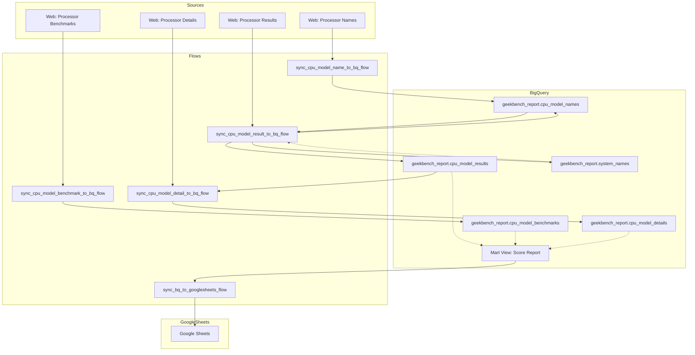

# Geekbench Report Automation

This project automates the collection and reporting of Geekbench CPU benchmark data. It utilizes Prefect for orchestration, BigQuery for data storage, and Google Sheets for reporting.

## Data Flow

The following diagram illustrates the data dependencies and flow between components:

## Flows

- **`sync_cpu_model_benchmark_to_bq_flow.py`**: Scrapes processor benchmarks from Geekbench Browser and saves to `cpu_model_benchmarks`.
- **`sync_cpu_model_name_to_bq_flow.py`**: Scrapes all available CPU model names and updates `cpu_model_names`.
- **`sync_cpu_model_result_to_bq_flow.py`**: Iterates through CPU models, scrapes their results pages (incremental update supported), and saves to `cpu_model_results`. dynamically updates `system_names` and `cpu_model_names` if new entities are found.
- **`sync_cpu_model_detail_to_bq_flow.py`**: Scrapes detailed specifications for CPU models found in results but missing details, saving to `cpu_model_details`.
- **`sync_bq_to_googlesheets_flow.py`**: Reads aggregated data from a BigQuery Mart view and updates a Google Sheet report.
